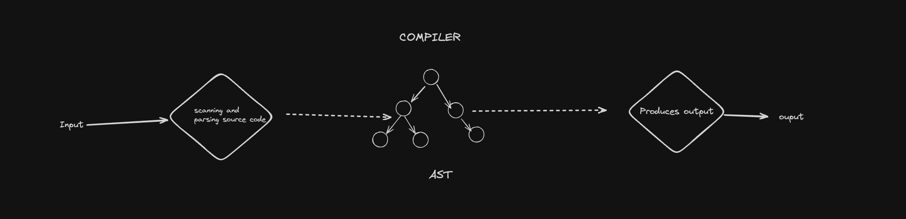
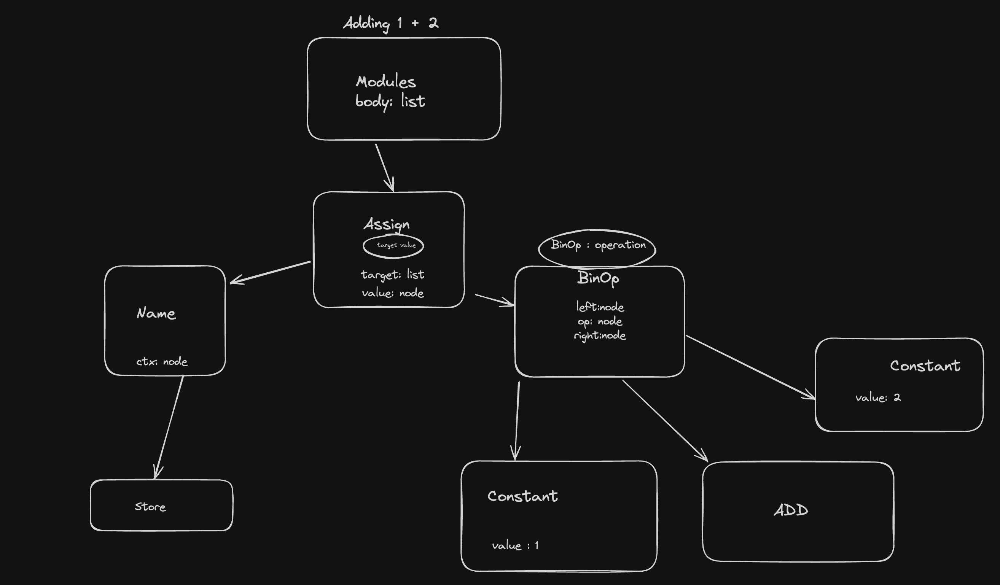
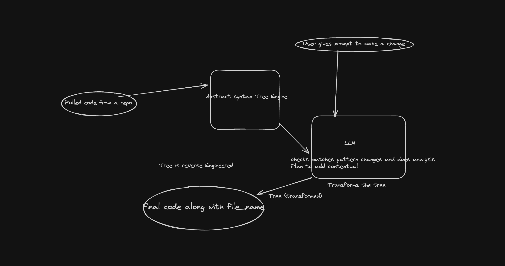

# AST Engine

This Engine is designed to make code changes across multiple files in a Python repository if code is changed in 1 file. It uses an Abstract Syntax Tree (AST) parser to analyze the code structure and a LLM component to understand the task and map it to code changes and finally convert the AST into code. 

## System Design

The system design has been inspired by the design of a compiler:

But instead of an output Engine at the end, I have connected a LLM to it (as if now).

The system consists of the following main components:

### Code Parser:
 This component is responsible for parsing the Python code files into Abstract Syntax Trees Engine. It handles different Python versions and syntax variations across files. The parser also takes care of preserving comments and docstrings based on the specified requirements. What it essentially does is that parses the python code and give out AST.

AST for adding 1 & 2 
### Adding LLM:
A LLM is added to the end instead of using an output engine, which performs contextual analysis on the tree by comparing the old tree and the new changed tree.

As if right now the Trees being too big for the token size of current gen models I have hard codded a Tree in (refactor.py) 

The LLM modifies the ASTs based on the desired changes identified by the NLP component. It handles potential conflicts or dependencies between files, such as import statements and function calls.

#### Note
(This task can also be done by making our own custom output engine as well.)

After modifying the ASTs, this component generates the updated Python code files from the modified ASTs.

### Output 
This component prepares the output in the desired format, which is a dictionary of `{"file_name": ("old_state", "new_state")}`. Additional information, such as specific changes made or line numbers modified, may be included as well.

### Potential Optimizations
To handle large codebases and make changes across multiple files efficiently, the system may employ optimizations or parallelization techniques to improve performance.

### Integration 
The system can be integrated into existing workflows or development tools (e.g., IDEs, version control systems) through a command-line interface or an API.

## License
[MIT]